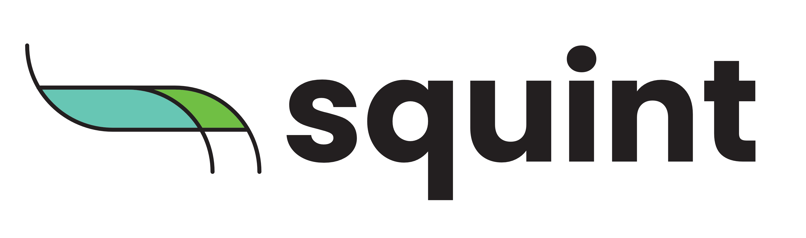

#

<p align="center">
  
</p>

<div align="center">
    <!-- <h2 align="center">
    squint
    </h2> -->
    <div>
    Welcome to <b>squint</b>, a differentiable framework for the study and design of quantum metrology & sensing protocols!
    </div>
</div>

[](https://github.com/benjimaclellan/squint/actions/workflows/pytest.yml)

[](https://opensource.org/licenses/Apache-2.0)
[](https://github.com/astral-sh/ruff)

<!-- Welcome to **squint**, a differentiable framework for studying and designing quantum metrology and sensing protocols! -->

## What can it do?

- **Differentiable quantum dynamics** for qubit, qudit, and Fock/photon-number systems
- **Built on the JAX ecosystem** for automatic differentiation and GPU hardware acceleration
- **Compute Fisher information** and other fundamental metrics in quantum metrology with ease
- **Benchmark realistic protocols** with noise and loss channels relevant to diverse device architectures


## Installation

Simply clone the repo locally,

```bash
git clone https://github.com/benjimaclellan/squint
cd squint
```

Use `uv` for the package management. Installation instructions are [here](https://docs.astral.sh/uv/getting-started/installation/).

Create a virtual environment with all the correct dependencies and activate it,

```bash
uv sync
source .venv/bin/activate
```

## Example

```python
from squint.circuit import Circuit
from squint.simulator.tn import Simulator
from squint.ops.base import Wire
from squint.ops.dv import DiscreteVariableState, HGate, RZGate
from squint.utils import print_nonzero_entries, partition_op

# let's implement a simple one-qubit circuit for phase estimation;
#          _____     _________     _____      _____
# |0 > --- | H | --- | Rz(Φ) | --- | H | ---- | / |====
#          -----     ---------     -----      -----

wire = Wire(dim=2, idx=0)  # qubit with dim=2
circuit = Circuit()
circuit.add(DiscreteVariableState(wires=(wire,), n=(0,)))
circuit.add(HGate(wires=(wire,)))
circuit.add(RZGate(wires=(wire,), phi=0.0 * jnp.pi), "phase")
circuit.add(HGate(wires=(wire,)))

params, static = partition_op(circuit, "phase")
sim = Simulator.compile(static, params, optimize="greedy").jit()

# Calculate metrics important to quantum metrology & sensing protocols
# the quantum state and its gradient
psi = sim.amplitudes.forward(params)      # |ψ(φ)⟩
dpsi = sim.amplitudes.grad(params)        # ∂|ψ(φ)⟩/∂φ

# Probabilities and their gradients
p = sim.probabilities.forward(params)     # p(s|φ)
dp = sim.probabilities.grad(params)       # ∂p(s|φ)/∂φ

qfi = sim.amplitudes.qfim(params)       # Quantum Fisher Information
cfi = sim.probabilities.cfim(params)    # Classical Fisher Information
```


## Roadmap

> [!NOTE]
> This package is still under heavy development, so expect major breaking changes in future versions.

`squint` aims to provide high-performance, flexible simulation tooling for quantum metrology, sensing, and photonics systems. 
Future plans including adding the ability to specify operations acting on internal and coupled degrees-of-freedom of optical information carriers, abstract POVM and post-selected measurements, and addition figures-of-merit relevant to quantum optical and metrology protocols.

## Using & Contributing

If this package is useful for your work, and you have feature suggestions and feedback, please reach out by email or open a discussion on Github!


## Acknowledgments

The authors of `squint` acknowledge the kind support of
[Ki3 Photonics Technologies](https://ki3photonics.com),
the [Perimeter Institute Quantum Intelligence Lab](https://perimeterinstitute.ca/perimeter-institute-quantum-intelligence-lab-piquil),
the [Institute for Quantum Computing](https://uwaterloo.ca/institute-for-quantum-computing/),
and the NSERC Vanier Program.

## Citing

If you found this package useful, please consider citing our work;

```tex
@article{maclellan2024endtoend,
  title={End-to-end variational quantum sensing}, 
  author={Benjamin MacLellan and Piotr Roztocki and Stefanie Czischek and Roger G. Melko},
  year={2024},
  eprint={2403.02394},
  archivePrefix={arXiv},
  primaryClass={quant-ph}
}
```
